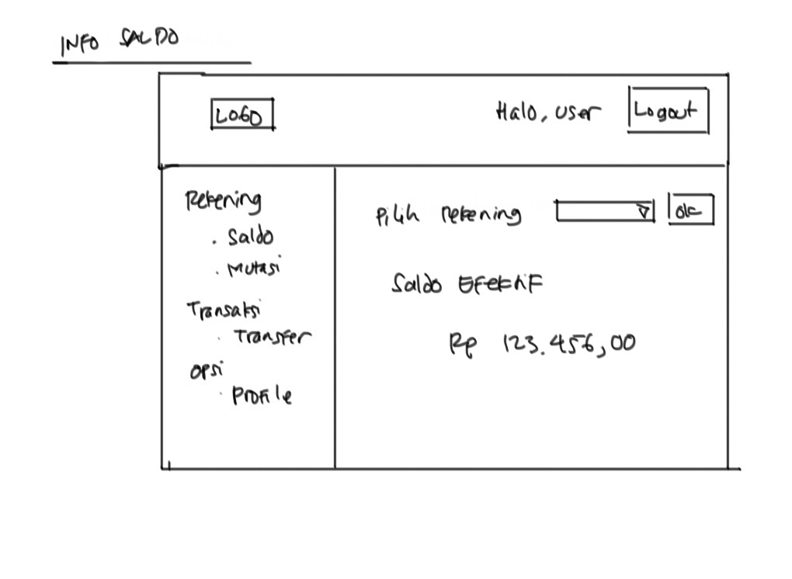
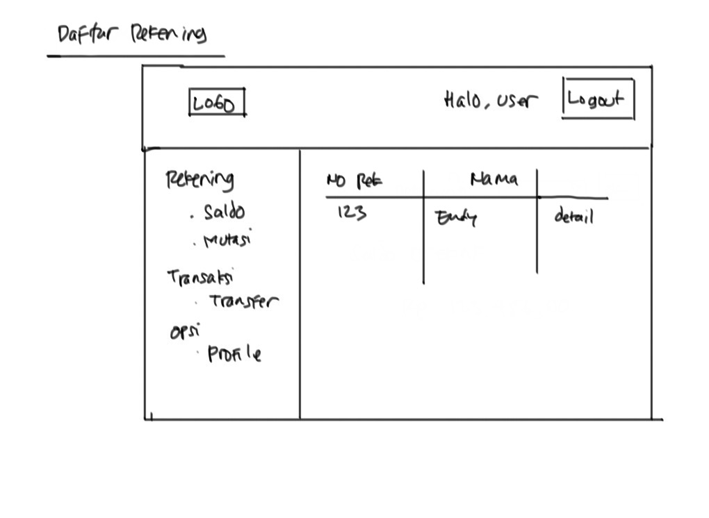
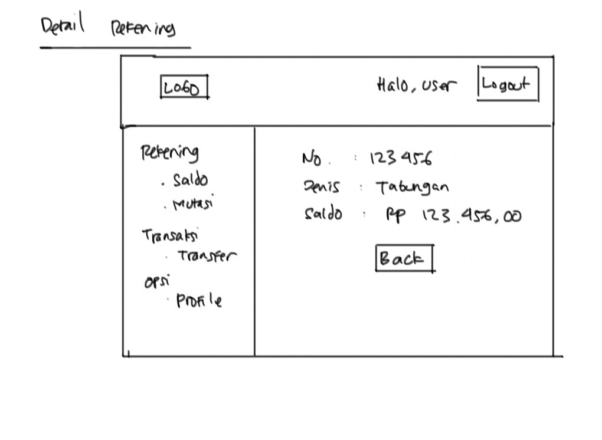
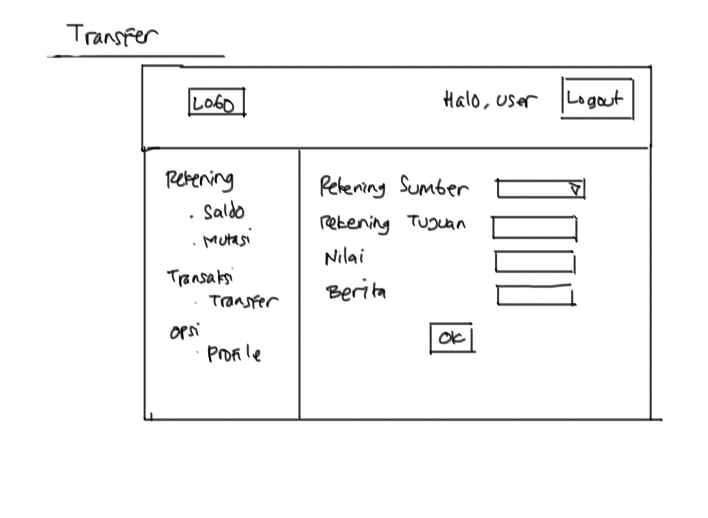
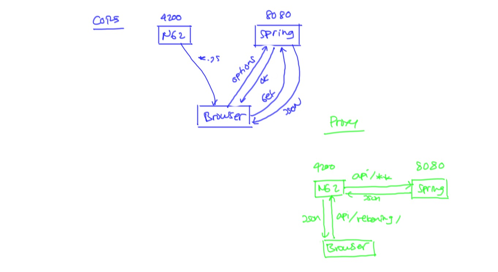
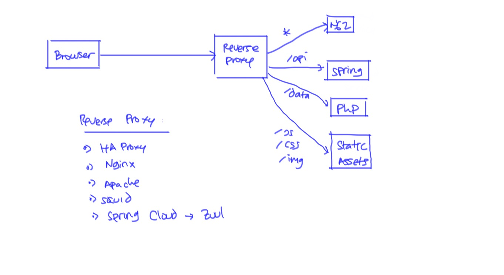

# Training Angular 2 #

Materi:

* Setup Project
* Menu dan Navigasi
* Menampilkan data di tabel
* Input data dengan form
* HTTP Request/Response
* Upload File
* Authentication

## Studi Kasus ##

Aplikasi Internet Banking.

Fitur :

* Login/Logout

* Info Saldo

* Daftar Rekening

* Detail Rekening

* Mutasi Rekening

* Transfer

* Update Profile

## Rancangan Aplikasi ##

Daftar Modul dan Komponen

* Modul Otentikasi

    * Komponen CurrentUser
    * Service Authentication

* Komponen Navigasi

* Modul Rekening

    * Service Rekening
    * Komponen Daftar Rekening
    * Komponen Detail Rekening

* Modul Mutasi

    * Service Mutasi
    * Komponen Form Pencarian
    * Komponen Daftar Mutasi
    * Komponen Detail Mutasi

* Modul Transfer

    * Service Transfer
    * Komponen Form Transfer
    * Komponen Konfirmasi Transfer

* Modul Profil

    * Service Profil
    * Komponen Form Profil
    * Komponen Tampilkan Profil

## Arsitektur Aplikasi Angular 2 ##

* [Cara membuat modul](catatan/membuat-modul.md)

## HTTP Request ke Backend ##

Pada waktu melakukan HTTP Request ke backend yang berbeda host/port, harus memperhatikan [masalah CORS](https://en.wikipedia.org/wiki/Cross-origin_resource_sharing).

Supaya kita tidak terkena masalah CORS, sebaiknya menggunakan proxy seperti ini

Demikian juga waktu deploy ke production, sebaiknya menggunakan reverse proxy atau load balancer seperti ini

